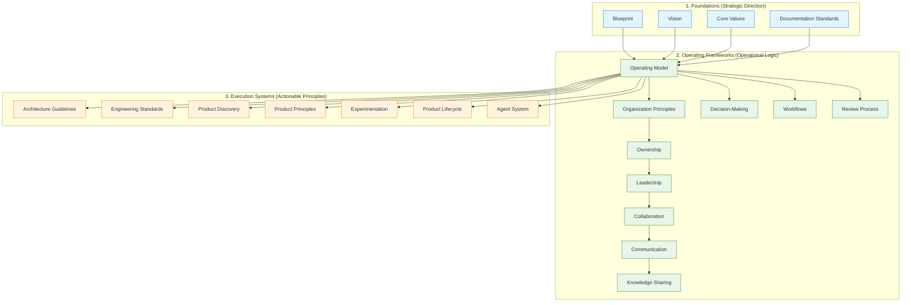

# Vector Labs Studio

Vector Labs Studio is an open operating handbook for building modern, AI-native software studios. It defines the foundational philosophies, operating frameworks, and execution systems used to establish a self-improving, highly leverage-driven software company where humans, systems, and automation collaborate as a unified system.

---

## Why This Repository Exists

Most software organizations spend significant effort documenting temporary processes—ticketing rules, meeting schedules, or tool-specific configurations—yet rarely capture the underlying principles that drive their decisions. This results in organizational drift, fragmented alignment, and constant reinvention of resolved concepts.

This repository exists to preserve **enduring organizational thinking** rather than transient operational procedures. By establishing timeless, technology-independent, and implementation-agnostic principles, we build a stable, self-improving system where learning compounds over time.

---

## What Makes This Handbook Different

Unlike typical corporate playbooks, this handbook operates under a distinct set of guiding beliefs:

*   **Principles over Procedures**: We rely on shared beliefs and reasoned judgment to guide decisions, avoiding rigid rules that restrict adaptability.
*   **Systems over Heroics**: We build leverage through simple, robust systems, automation, and compounding knowledge rather than depending on individual heroic effort.
*   **Clarity over Complexity**: We scale the Studio by distributing clear context, goals, and constraints, resisting operational and technical complexity at all layers.
*   **Continuous Learning**: Every task, success, and failure is treated as feedback to refine our shared systems, ensuring the organization grows more capable over time.
*   **Timeless Guidance**: We write standards that remain valid across changing technologies, frameworks, and team compositions.

---

## How the Handbook is Organized

The handbook is organized into three logical, progressive layers. Each layer establishes the boundaries and context for the next:

### 1. Foundations (Strategic Direction)
These documents establish our core identity, long-term vision, behavioral expectations, and documentation philosophy.
*   **[BLUEPRINT.md](docs/BLUEPRINT.md)**: The entry point to our knowledge system and repository structure.
*   **[VISION.md](docs/VISION.md)**: Outlines our long-term direction, tenets, and success criteria as an AI-native company.
*   **[CORE_VALUES.md](docs/CORE_VALUES.md)**: Defines the behavioral values and decision guidelines expected of all contributors.
*   **[DOCUMENTATION_STANDARDS.md](docs/DOCUMENTATION_STANDARDS.md)**: Establishes our documentation-first principles and durable memory standards.

### 2. Operating Frameworks (Operational Logic)
These documents define how we organize, collaborate, make decisions, and manage responsibility.
*   **[ORGANIZATION_PRINCIPLES.md](docs/ORGANIZATION_PRINCIPLES.md)**: Establishes relationships, authority, and leverage-driven organizational design.
*   **[OWNERSHIP.md](docs/OWNERSHIP.md)**: Defines how responsibility is carried through responsible stewardship of outcomes.
*   **[LEADERSHIP.md](docs/LEADERSHIP.md)**: Outlines how direction, clarity, and alignment are created without centralized bottlenecks.
*   **[COLLABORATION.md](docs/COLLABORATION.md)**: Defines how contributors work together, leveraging complementary strengths and constructive disagreement.
*   **[COMMUNICATION.md](docs/COMMUNICATION.md)**: Governs the effective movement of information, prioritizing context and default transparency.
*   **[KNOWLEDGE_SHARING.md](docs/KNOWLEDGE_SHARING.md)**: Establishes how individual learning compounds into organizational capability.
*   **[OPERATING_MODEL.md](docs/OPERATING_MODEL.md)**: Explains the high-level collaborative relationships between humans and system capabilities.
*   **[DECISION_MAKING.md](docs/DECISION_MAKING.md)**: Outlines our thinking model, alternative evaluations, and risk classification (one-way/two-way doors).
*   **[WORKFLOWS.md](docs/WORKFLOWS.md)**: Establishes the workflow philosophy and the common lifecycle of work.
*   **[REVIEW_PROCESS.md](docs/REVIEW_PROCESS.md)**: Outlines how work builds confidence and quality before merging.

### 3. Execution Systems (Actionable Principles)
These documents apply our high-level frameworks to specific outputs, including engineering, product discovery, and agent capabilities.
*   **[ARCHITECTURE_GUIDELINES.md](docs/ARCHITECTURE_GUIDELINES.md)**: Focuses on managing complexity, interface design, and enabling safe system evolution.
*   **[ENGINEERING_STANDARDS.md](docs/ENGINEERING_STANDARDS.md)**: Establishes guidelines for maintainability, built-in quality, and simplicity.
*   **[PRODUCT_DISCOVERY.md](docs/PRODUCT_DISCOVERY.md)**: Outlines how we assess opportunities and reduce uncertainty before making product commitments.
*   **[PRODUCT_PRINCIPLES.md](docs/PRODUCT_PRINCIPLES.md)**: Defines our core product philosophy and opportunity worthiness criteria.
*   **[EXPERIMENTATION.md](docs/EXPERIMENTATION.md)**: Outlines how we run disciplined, decision-relevant trials to learn under uncertainty.
*   **[PRODUCT_LIFECYCLE.md](docs/PRODUCT_LIFECYCLE.md)**: Establishes how products evolve from inception to retirement.
*   **[AGENT_SYSTEM.md](docs/AGENT_SYSTEM.md)**: Focuses on agent design, governance, and model replaceability.

---

## Where Readers Should Begin

To build context progressively, we recommend reading the handbook in the following sequence. Each layer builds upon the foundational and operational models established before it:

1.  **[BLUEPRINT.md](docs/BLUEPRINT.md)** (Orientation and entry point)
2.  **[VISION.md](docs/VISION.md)** (Destination and tenets)
3.  **[CORE_VALUES.md](docs/CORE_VALUES.md)** (Behavioral standards)
4.  **[DOCUMENTATION_STANDARDS.md](docs/DOCUMENTATION_STANDARDS.md)** (Documentation philosophy)
5.  **[ORGANIZATION_PRINCIPLES.md](docs/ORGANIZATION_PRINCIPLES.md)** (Organizational philosophy)
6.  **[OWNERSHIP.md](docs/OWNERSHIP.md)** (Ownership philosophy)
7.  **[LEADERSHIP.md](docs/LEADERSHIP.md)** (Leadership philosophy)
8.  **[COLLABORATION.md](docs/COLLABORATION.md)** (Collaboration philosophy)
9.  **[COMMUNICATION.md](docs/COMMUNICATION.md)** (Communication philosophy)
10. **[KNOWLEDGE_SHARING.md](docs/KNOWLEDGE_SHARING.md)** (Knowledge-sharing philosophy)
11. **[OPERATING_MODEL.md](docs/OPERATING_MODEL.md)** (Operational mechanics)
12. **[DECISION_MAKING.md](docs/DECISION_MAKING.md)** (Thinking model)
13. **[WORKFLOWS.md](docs/WORKFLOWS.md)** (Common lifecycle of work)
14. **[REVIEW_PROCESS.md](docs/REVIEW_PROCESS.md)** (Confidence-building philosophy)
15. **[ARCHITECTURE_GUIDELINES.md](docs/ARCHITECTURE_GUIDELINES.md)** (Core architectural principles)
16. **[ENGINEERING_STANDARDS.md](docs/ENGINEERING_STANDARDS.md)** (Core engineering principles)
17. **[PRODUCT_DISCOVERY.md](docs/PRODUCT_DISCOVERY.md)** (Product discovery philosophy)
18. **[PRODUCT_PRINCIPLES.md](docs/PRODUCT_PRINCIPLES.md)** (Product philosophy)
19. **[EXPERIMENTATION.md](docs/EXPERIMENTATION.md)** (Experimentation philosophy)
20. **[PRODUCT_LIFECYCLE.md](docs/PRODUCT_LIFECYCLE.md)** (Product lifecycle evolution)
21. **[AGENT_SYSTEM.md](docs/AGENT_SYSTEM.md)** (Agent integration principles)

---

## How Contributors Can Help

We treat our organization itself as an evolving system. If you want to contribute, please align your proposals with our core writing principles:

*   **Timelessness**: Focus on enduring principles rather than temporary tools, platforms, or configurations.
*   **Clear Boundaries**: Respect document scopes; do not bleed adjacent concepts into unrelated files.
*   **Principle-Driven**: Provide guidance, cognitive frameworks, and reasoning over rigid step-by-step rules.
*   **Implementation Independence**: Keep all writing agnostic of specific programming languages, frameworks, or operational tools.
*   **Architectural Consistency**: Ensure new proposals do not duplicate, redefine, or contradict existing standards.

---

## License

This project is licensed under the terms of the MIT License. See the [LICENSE](LICENSE) file for details.
