# Vector Labs Studio Handbook

## Version
0.1.0

## Status
Living

## Owner
Founder

## Last Updated
2026-07-19

## Purpose
This README serves as the navigation guide and entry point to the Vector Labs Studio handbook. It is designed to orient both human contributors and AI agents, explaining how the handbook is organized, where to start reading, and how the documents relate to one another.

---

## Handbook Structure
Our documentation is organized into three logical layers, moving from foundational context to operating frameworks, and finally to execution systems. Higher-level documents define the boundaries and expectations for lower-level documents.

```mermaid
graph TD
    classDef default fill:#f9f9f9,stroke:#333,stroke-width:1px;
    classDef foundation fill:#e1f5fe,stroke:#0288d1,stroke-width:1px;
    classDef framework fill:#e8f5e9,stroke:#388e3c,stroke-width:1px;
    classDef execution fill:#fff3e0,stroke:#f57c00,stroke-width:1px;

    subgraph Foundations ["1. Foundations (Strategic Direction)"]
        blueprint["Blueprint"]:::foundation
        vision["Vision"]:::foundation
        values["Core Values"]:::foundation
        doc_standards["Documentation Standards"]:::foundation
    end

    subgraph Frameworks ["2. Operating Frameworks (Operational Logic)"]
        op_model["Operating Model"]:::framework
        dec_making["Decision-Making"]:::framework
        workflows["Workflows"]:::framework
        review["Review Process"]:::framework
    end

    subgraph Execution ["3. Execution Systems (Actionable Principles)"]
        architecture["Architecture Guidelines"]:::execution
        eng_standards["Engineering Standards"]:::execution
        prod_discovery["Product Discovery"]:::execution
        prod_principles["Product Principles"]:::execution
        experimentation["Experimentation"]:::execution
        lifecycle["Product Lifecycle"]:::execution
        agents["Agent System"]:::execution
    end

    blueprint --> op_model
    vision --> op_model
    values --> op_model
    doc_standards --> op_model
    op_model --> dec_making
    op_model --> workflows
    op_model --> review
    op_model --> architecture
    op_model --> eng_standards
    op_model --> prod_discovery
    op_model --> prod_principles
    op_model --> experimentation
    op_model --> lifecycle
    op_model --> agents
```

### 1. Foundations
These documents establish the purpose, baseline identity, and cross-cutting principles of the Studio.
*   **[BLUEPRINT.md](file:///Users/muratcanbur/Desktop/vectorlabs-studio/docs/BLUEPRINT.md)**: The entry point to the operating model and knowledge system, defining how the documentation and repository are structured.
*   **[VISION.md](file:///Users/muratcanbur/Desktop/vectorlabs-studio/docs/VISION.md)**: Outlines the long-term, stable direction, core tenets, and success criteria for the Studio as an AI-native company.
*   **[CORE_VALUES.md](file:///Users/muratcanbur/Desktop/vectorlabs-studio/docs/CORE_VALUES.md)**: Defines the behavioral values, expected actions, and decision guidelines for all contributors (humans and agents).
*   **[DOCUMENTATION_STANDARDS.md](file:///Users/muratcanbur/Desktop/vectorlabs-studio/docs/DOCUMENTATION_STANDARDS.md)**: Defines the core values and philosophy of documentation within the Studio's durable memory.

### 2. Operating Frameworks
These documents define the relationships, collaboration patterns, and decision models that govern Studio activity.
*   **[OPERATING_MODEL.md](file:///Users/muratcanbur/Desktop/vectorlabs-studio/docs/OPERATING_MODEL.md)**: Explains how humans, AI agents, automation, and products interact to form a compounding learning loop.
*   **[DECISION_MAKING.md](file:///Users/muratcanbur/Desktop/vectorlabs-studio/docs/DECISION_MAKING.md)**: Establishes the cognitive and analytical framework used to evaluate evidence, weigh trade-offs, and make high-quality decisions.
*   **[WORKFLOWS.md](file:///Users/muratcanbur/Desktop/vectorlabs-studio/docs/WORKFLOWS.md)**: Establishes the workflow philosophy and the common lifecycle of work across the Studio.
*   **[REVIEW_PROCESS.md](file:///Users/muratcanbur/Desktop/vectorlabs-studio/docs/REVIEW_PROCESS.md)**: Establishes the philosophy of review as a collaborative, knowledge-building, and confidence-building activity.

### 3. Execution Systems
These documents outline the principles governing specific outputs and components within our operating model.
*   **[ARCHITECTURE_GUIDELINES.md](file:///Users/muratcanbur/Desktop/vectorlabs-studio/docs/ARCHITECTURE_GUIDELINES.md)**: Establishes the core architectural principles for managing complexity and enabling safe system evolution.
*   **[ENGINEERING_STANDARDS.md](file:///Users/muratcanbur/Desktop/vectorlabs-studio/docs/ENGINEERING_STANDARDS.md)**: Establishes the core engineering principles for maintainability, simplicity, adaptability, and data-driven decisions.
*   **[PRODUCT_DISCOVERY.md](file:///Users/muratcanbur/Desktop/vectorlabs-studio/docs/PRODUCT_DISCOVERY.md)**: Establishes the discovery philosophy and the principles for reducing uncertainty before making product commitments.
*   **[PRODUCT_PRINCIPLES.md](file:///Users/muratcanbur/Desktop/vectorlabs-studio/docs/PRODUCT_PRINCIPLES.md)**: Establishes the core product philosophy and the principles for evaluating product opportunities.
*   **[EXPERIMENTATION.md](file:///Users/muratcanbur/Desktop/vectorlabs-studio/docs/EXPERIMENTATION.md)**: Establishes the experimentation philosophy and the principles for learning responsibly under uncertainty.
*   **[PRODUCT_LIFECYCLE.md](file:///Users/muratcanbur/Desktop/vectorlabs-studio/docs/PRODUCT_LIFECYCLE.md)**: Defines how products evolve from problem discovery to eventual retirement as continuously improved systems.
*   **[AGENT_SYSTEM.md](file:///Users/muratcanbur/Desktop/vectorlabs-studio/docs/AGENT_SYSTEM.md)**: Outlines the principles, governance, and collaboration model for AI agents.

---

## Recommended Reading Order
For new contributors (human or AI), we recommend reading the handbook in the following sequence to build context progressively:
1.  **[BLUEPRINT.md](file:///Users/muratcanbur/Desktop/vectorlabs-studio/docs/BLUEPRINT.md)** (Orientation and entry point)
2.  **[VISION.md](file:///Users/muratcanbur/Desktop/vectorlabs-studio/docs/VISION.md)** (Destination and tenets)
3.  **[CORE_VALUES.md](file:///Users/muratcanbur/Desktop/vectorlabs-studio/docs/CORE_VALUES.md)** (Behavioral standards)
4.  **[DOCUMENTATION_STANDARDS.md](file:///Users/muratcanbur/Desktop/vectorlabs-studio/docs/DOCUMENTATION_STANDARDS.md)** (Documentation philosophy)
5.  **[OPERATING_MODEL.md](file:///Users/muratcanbur/Desktop/vectorlabs-studio/docs/OPERATING_MODEL.md)** (Operational mechanics)
6.  **[DECISION_MAKING.md](file:///Users/muratcanbur/Desktop/vectorlabs-studio/docs/DECISION_MAKING.md)** (Thinking model)
7.  **[WORKFLOWS.md](file:///Users/muratcanbur/Desktop/vectorlabs-studio/docs/WORKFLOWS.md)** (Common lifecycle of work)
8.  **[REVIEW_PROCESS.md](file:///Users/muratcanbur/Desktop/vectorlabs-studio/docs/REVIEW_PROCESS.md)** (Confidence-building philosophy)
9.  **[ARCHITECTURE_GUIDELINES.md](file:///Users/muratcanbur/Desktop/vectorlabs-studio/docs/ARCHITECTURE_GUIDELINES.md)** (Core architectural principles)
10. **[ENGINEERING_STANDARDS.md](file:///Users/muratcanbur/Desktop/vectorlabs-studio/docs/ENGINEERING_STANDARDS.md)** (Core engineering principles)
11. **[PRODUCT_DISCOVERY.md](file:///Users/muratcanbur/Desktop/vectorlabs-studio/docs/PRODUCT_DISCOVERY.md)** (Product discovery philosophy)
12. **[PRODUCT_PRINCIPLES.md](file:///Users/muratcanbur/Desktop/vectorlabs-studio/docs/PRODUCT_PRINCIPLES.md)** (Product philosophy)
13. **[EXPERIMENTATION.md](file:///Users/muratcanbur/Desktop/vectorlabs-studio/docs/EXPERIMENTATION.md)** (Experimentation philosophy)
14. **[PRODUCT_LIFECYCLE.md](file:///Users/muratcanbur/Desktop/vectorlabs-studio/docs/PRODUCT_LIFECYCLE.md)** (Product lifecycle evolution)
15. **[AGENT_SYSTEM.md](file:///Users/muratcanbur/Desktop/vectorlabs-studio/docs/AGENT_SYSTEM.md)** (Agent integration principles)
